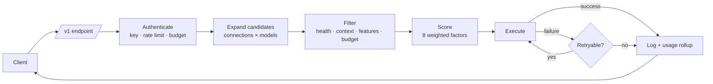

# Switchboard

[](https://github.com/abeermeer/switchboard/actions/workflows/ci.yml)
[](#tests)
[](LICENSE)
[](https://nodejs.org)

**One endpoint. Every provider. Free tiers first, automatic fallback, everything local.**

Switchboard is an AI gateway that runs on your own machine. Point any OpenAI-compatible
tool at it and it decides — per request — which provider and model should serve the call,
preferring free tiers, routing around outages, and recording exactly why it chose what it
chose.

```
your tools ──▶ http://127.0.0.1:7272/v1 ──▶ Groq · Cerebras · Google · OpenRouter
                                            DeepSeek · Mistral · OpenAI · Anthropic …
```

Nothing leaves your machine except the upstream provider calls themselves. No telemetry,
no account, no cloud control plane.

---

## Demo

[](https://github.com/abeermeer/switchboard/releases/download/v0.4.1/brag.mp4)

**[▶ Watch the 20-second walkthrough](https://github.com/abeermeer/switchboard/releases/download/v0.4.1/brag.mp4)**

A provider 429s mid-request, the fallback lands on a different one, and the decision trace
explains exactly why the replacement won. Every number on screen is real output from a
running instance — the response headers, the four candidate scores, the factor notes, and
the exclusion reason.

That still above is the routing decision for one request: four candidates ranked, the
winner in copper, the price spread across providers serving the same class of model, and
`17 eligible · 5 excluded`. Every other gateway gives you a log line; this is the part
worth showing.

---

## Why

Running six provider SDKs across four tools means six sets of keys, six failure modes, and
no idea what any of it costs. Switchboard collapses that into one endpoint with one key,
and answers three questions the raw SDKs cannot:

- **Which provider should serve this?** Scored live on health, latency, price and tier.
- **What happens when it is down?** The next candidate takes it, transparently.
- **What is this actually costing me?** Per request, per model, per key, against a
  frontier-pricing baseline.

### What makes it different

Plenty of tools proxy several providers. The distinction here is that Switchboard **shows
its work**.

| | Typical gateway | Switchboard |
| --- | --- | --- |
| Why a provider was chosen | A log line, if anything | Every candidate stored with its eight weighted score factors |
| Why the others lost | Not recorded | An explicit exclusion reason per candidate, rendered in the UI |
| Tuning a routing policy | Change it and send real traffic | Simulate it — score the ranking without sending anything upstream |
| Free-tier requests | Billed at list price | Settled at **$0**, so the ladder ranks correctly and spend is honest |
| Install | Native module, needs a toolchain | `node:sqlite` — no node-gyp, identical on Windows |
| Where a failure shows up | In your client, as a 500 | Absorbed by the fallback walk; the client sees a 200 |

---

## Quickstart

**1) Install and run**

```bash
npm install -g switchboard-gateway
switchboard
```

That's it. The dashboard is on **http://localhost:7272**, the gateway on
**http://localhost:7272/v1**.

> The npm package is **`switchboard-gateway`** — plain `switchboard` on npm is an unrelated
> 2022 event-listener library with no executable, so installing that gives you no command.
> The commands this package installs are still `switchboard` and `sb`.

Your database and encryption key live in your OS application-data directory
(`%APPDATA%\Switchboard`, `~/Library/Application Support/Switchboard`, or
`~/.local/share/Switchboard`), so upgrading with `npm update -g switchboard-gateway` never
touches them.

**2) Connect a free provider**

Open the dashboard and pick one. Groq, Cerebras and Google all give real free tiers with
no payment method. Or from the terminal:

```bash
sb providers add groq      # prompts for the key, echo off
```

**3) Create a key and point a tool at it**

```bash
sb keys new "my laptop"
```

```bash
curl http://127.0.0.1:7272/v1/chat/completions \
  -H "Authorization: Bearer sb-live-your-key" \
  -H "Content-Type: application/json" \
  -d '{"model":"auto","messages":[{"role":"user","content":"Hello"}]}'
```

<details>
<summary><b>Other ways to run it</b></summary>

**From source**

```bash
git clone https://github.com/abeermeer/switchboard.git
cd switchboard
npm install
npm run build
npm start
```

**Docker**

```bash
docker build -t switchboard .
docker run -d -p 7272:7272 -v switchboard-data:/data switchboard
```

**Desktop app** — `npm run electron:build:win` (or `:mac` / `:linux`) puts an installer in
`release/`. Runs in the tray with start-at-login.

**Pin to a release line** — every version is branched, so you can track one:

```bash
npm install -g switchboard-gateway@0.4.1
```

</details>

`"model": "auto"` hands the decision to the router. You can also send a bare model id
(`llama-3.3-70b-versatile`), a pinned provider (`groq/llama-3.3-70b-versatile`), or a
policy slug you have defined.

---

## Point your tools at it

**Claude Code**

```bash
export ANTHROPIC_BASE_URL="http://127.0.0.1:7272/v1"
export ANTHROPIC_API_KEY="sb-live-your-key"
```

**Cursor** — Settings → Models → Override OpenAI Base URL

```
Base URL:  http://127.0.0.1:7272/v1
API Key:   sb-live-your-key
Model:     auto
```

**OpenAI SDK (Python)**

```python
from openai import OpenAI

client = OpenAI(base_url="http://127.0.0.1:7272/v1", api_key="sb-live-your-key")
response = client.chat.completions.create(
    model="auto",
    messages=[{"role": "user", "content": "Hello"}],
)
```

**OpenAI SDK (Node)**

```js
import OpenAI from 'openai';

const client = new OpenAI({
  baseURL: 'http://127.0.0.1:7272/v1',
  apiKey: 'sb-live-your-key',
});
```

**Cline / Continue / Aider** — any "OpenAI-compatible endpoint" field takes the same base
URL and key.

---

## Endpoints

| Method | Path | Notes |
| --- | --- | --- |
| `POST` | `/v1/chat/completions` | Streaming and non-streaming |
| `POST` | `/v1/completions` | Legacy, shimmed onto chat |
| `POST` | `/v1/embeddings` | |
| `POST` | `/v1/images/generations` | |
| `POST` | `/v1/audio/speech` | Returns audio bytes |
| `POST` | `/v1/audio/transcriptions` | Multipart upload |
| `POST` | `/v1/rerank` | |
| `POST` | `/v1/moderations` | |
| `GET` | `/v1/models` | Every model across every connected provider |
| `GET` | `/v1/models/{model}` | |

Every response carries routing telemetry, so you can debug from curl alone:

```
x-switchboard-request-id: req_6751a555d0264a6aa7e0
x-switchboard-provider: groq
x-switchboard-model: llama-3.3-70b-versatile
x-switchboard-tier: free
x-switchboard-attempts: 2
x-switchboard-cost-usd: 0.000083
x-switchboard-ttft-ms: 340
x-switchboard-fallback-reason: Rate limited (429), retry after 12s
```

`x-switchboard-fallback-reason` only appears when a fallback actually happened, so its
presence is itself the signal.

---

## Routing

A **policy** (called a combo in the API) is a model name your clients can send. Four ship
by default:

| Slug | Strategy | Optimises for |
| --- | --- | --- |
| `auto` | free-first | Exhaust free tiers before spending anything |
| `free-only` | free-first, $0 ceiling | Never spends money, fails instead |
| `fast` | fastest | Lowest observed time to first token |
| `quality` | quality-first | Strongest model available, price ignored |

Seven strategies are available:

| Strategy | Behaviour |
| --- | --- |
| `free-first` | Free tier, then cheap, then paid. The default. |
| `cost-optimized` | Lowest projected USD for this specific request. |
| `fastest` | Lowest measured p50 time-to-first-token. |
| `quality-first` | Inverts the cost factor — price becomes a quality signal. |
| `priority` | Strict chain order. Predictable, ignores live health. |
| `round-robin` | Spreads load across healthy members to stretch rate limits. |
| `failover` | First member always; others only on outright failure. |

Every candidate is scored on eight factors (health, latency, cost, tier, priority, quota,
throughput, stability), weighted per strategy. The weights are visible in the dashboard,
and the full arithmetic is stored with every request.

### The simulator

The routing page runs the exact expand-and-score path a live request takes, but stops
before sending anything upstream. Drag a member, move the cost ceiling, and watch the
ranking reshuffle — including which candidates were excluded and for what reason.

---

## Architecture



| Layer | Location |
| --- | --- |
| Domain contract | `src/types/core.ts` |
| Persistence | `src/lib/db/` — `node:sqlite`, WAL, append-only migrations |
| Providers | `src/lib/providers/` — catalog + 4 wire adapters |
| Resilience | `src/lib/resilience/`, `src/lib/health/` |
| Router | `src/lib/router/` — candidates → score → execute |
| Gateway API | `src/app/v1/` |
| Management API | `src/app/api/` |
| Dashboard | `src/app/(dashboard)/`, `src/components/` |

Storage is Node's built-in `node:sqlite` — no native module, no `node-gyp`, no prebuilt
binary roulette. `npm install` works the same on Windows as it does on Linux.

---

## Resilience

Three independent layers, so one failing provider never becomes a failing gateway:

1. **Circuit breaker**, per connection. Opens after N consecutive failures — immediately
   on a `401`, since a bad credential will not fix itself. Cooldown doubles on repeat
   opens, capped at 15 minutes, with jitter so recovering providers are not stampeded.
2. **Model lockout**, per model. A `429` locks out that one model rather than the whole
   connection, honouring `Retry-After` when the provider sends it.
3. **Fallback walk**, per request. Up to `maxAttempts` candidates, stopping early when
   retrying elsewhere cannot help — a malformed request produces the same `400` on every
   provider.

A streaming response that has already sent its first byte is **never** retried. Once bytes
are on the wire the client has committed, and a silent provider switch mid-stream would
corrupt the response.

---

## Configuration

Everything is optional; sane defaults are generated on first run.

| Variable | Default | Purpose |
| --- | --- | --- |
| `PORT` | `7272` | Gateway and dashboard |
| `SWITCHBOARD_DATA_DIR` | `./data` | Database, key vault, logs |
| `SWITCHBOARD_MASTER_KEY` | generated | Base64 32-byte key for credential encryption |
| `SWITCHBOARD_ALLOW_REMOTE` | `0` | Allow non-loopback dashboard access |
| `SWITCHBOARD_CORS_ORIGINS` | *(none)* | Origins allowed to call `/v1` from a browser |
| `SWITCHBOARD_LOG_LEVEL` | `info` / `debug` | `debug` · `info` · `warn` · `error` · `silent` |
| `SWITCHBOARD_LOG_FORMAT` | auto | `json`, or `pretty` in a TTY |
| `SWITCHBOARD_PACKAGED` | `0` | Set by the desktop build |

Provider credentials are sealed with **AES-256-GCM** before they touch disk. The master key
lives in `<data-dir>/master.key` with `0600` permissions. No endpoint returns a stored
credential — only a four-character hint.

### CORS

`/v1` sends **no** `Access-Control-Allow-Origin` by default. The endpoint is built for
server-side SDK clients, which send no `Origin` header and are unaffected by CORS — while a
wildcard would let any page you happen to visit spend your provider credentials the moment
it learned a key.

If a browser app calls the gateway directly, list its origins:

```bash
SWITCHBOARD_CORS_ORIGINS=http://localhost:3000,https://myapp.example
```

Allowed origins are reflected rather than wildcarded, with `Vary: Origin` so a shared cache
cannot hand one origin's response to another. `*` still works if you want the old
behaviour, but it is now a decision rather than a default.

### Logging

One JSON object per line on stdout, or a human-readable line in a TTY. Values that look
like credentials are redacted before anything is written — by key name (`authorization`,
`api_key`, `token`, …) and by shape, so a key pasted into free text is caught too.

```bash
switchboard 2>&1 | jq 'select(.level == "warn")'
```

The same redaction runs on the way **into** the database. Every request log row stores the
request body, the response and the routing decision, so a client that sends its own provider
key in a header — or pastes one into a prompt — would otherwise have it written to disk in
plain text and kept for as long as the row lives. Redacting at the storage boundary rather
than on the dashboard's read path means nothing else that can reach the table sees the
original either.

Rows are pruned to the **Log retention** setting on each health tick. `0` means keep
forever, which is a legitimate choice rather than an unconfigured one.

---

## CLI

```bash
sb start [--port] [--open]   # start the gateway
sb status                    # health at a glance
sb doctor                    # diagnose the install
sb providers list            # connections with status and spend
sb providers add groq        # prompts for the key, echo off
sb providers test <id>       # force a probe
sb models [--free]           # available models with pricing
sb combos                    # routing policies
sb keys new <name>           # create an API key
sb chat [--model]            # streaming REPL
sb logs [--errors]           # recent requests
sb usage [--days 7]          # spend summary
sb open                      # open the dashboard
```

---

## Desktop app

```bash
npm run electron:build:win   # or :mac / :linux
```

Produces an installer in `release/`. The desktop build runs the gateway as a child process,
writes to a real app-data directory, and lives in the system tray with start-at-login,
copy-endpoint and restart controls.

Icons are generated from the product mark rather than committed by hand:

```bash
npm run icons             # icon.png/.ico/.icns + tray at 1x and 2x
npm run verify:electron   # structural check, no toolchain download
```

`verify:electron` runs on every CI leg and is the cheap half of the packaging check: the
builder config loads, every referenced icon exists with the right magic bytes *and*
dimensions, `main.cjs` and `preload.cjs` parse, the preload goes through `contextBridge`
without handing over `ipcRenderer`, and `contextIsolation` / `sandbox` are still on. The
expensive half is a real `electron-builder` run on Windows and Linux in
[desktop.yml](.github/workflows/desktop.yml), which also asserts the installer is larger
than 20 MB — electron-builder exits 0 having shipped only the shell if the `files` globs are
wrong.

---

## Development

```bash
npm run dev            # dev server on :7272
npm run typecheck      # tsc --noEmit, strict
npm run build          # production build
npm run electron:dev   # desktop shell against the dev server
npm run verify:name    # the npm name still resolves to this repository
npm run verify:install # pack, install globally, run the command
```

`verify:install` is the check that matters before a release: it packs the tarball, installs
it into a throwaway global prefix, and runs `switchboard --version` and `sb --version`. Every
other check in CI runs against the repository, so none of them could tell that the published
install instruction pointed at a different package entirely.

Requires **Node 22.13+** — `node:sqlite` appeared in 22.5 but was flag-gated until 22.13.
Built with Next.js 16, React 19,
TypeScript 5.9 in strict mode with `noUncheckedIndexedAccess`, and Tailwind CSS v4.

Adding a provider is a single entry in `src/lib/providers/catalog.ts` when it speaks the
OpenAI wire format — see [docs/development.md](docs/development.md).

Conventions for humans and agents are in [CLAUDE.md](CLAUDE.md) and [AGENTS.md](AGENTS.md);
contribution workflow in [CONTRIBUTING.md](CONTRIBUTING.md).

### Tests

```bash
npm run test:run     # ~1,035 tests
npm run test:ci      # with coverage
```

Vitest, running on every CI leg. Roughly 75% overall, concentrated where a silent bug costs
money or loses a request:

| Area | Coverage |
| --- | --- |
| Scoring, cost and free-tier settlement, rate limiting | 100% |
| Adapter helpers — the error taxonomy every fallback depends on | 99% |
| Candidate expansion and exclusion reasons | 95% |
| Circuit breaker state machine | 100% statements |
| Wire translation for Anthropic, Google and Cohere | ~80% |
| Credential vault and the redaction layer | ~94% |

The adapter tests run through the real `execute()` path with `fetch` stubbed, so each one
covers the URL, the auth headers, both translation directions and the error classification
together. There are integration tests for the gateway and the management API, and component
tests for the UI primitives, the live-event transport's reconnection, and the policy
editor.

Tests assert the behaviour the code's comments claim, so the deliberate decisions
(`bad_request` never retries, a started stream is never retried, free tiers settle at $0)
fail loudly if anyone "simplifies" them away.

### Releases

`main` is the development line. Every version is also cut as a `release/vX.Y.Z` branch with
a matching tag and GitHub release, so you can pin to one and keep receiving fixes for that
line without inheriting whatever landed on `main` today.

Bumping `version` in `package.json` on `main` triggers it: CI typechecks, tests, builds,
boots the gateway, verifies the publish tarball carries no database or key, then branches,
tags and publishes the release.

A running record of what changed and why is in [SESSION_SUMMARY.md](SESSION_SUMMARY.md),
including the findings that are known and deliberately unfixed.

### Status

Pre-1.0, and specific about what that means.

An external audit put it at **7.2/10** — strong on architecture, resilience and type
safety, with test coverage scored **0/10** as the single largest gap, alongside five
smaller findings. A second pass raised four more once those were closed. All ten are now
closed:

| Finding | Resolution |
| --- | --- |
| No test suite | 1,035 tests; the routing core at 95–100% |
| Rate limiting reset on restart | Persisted in SQLite, counted per second so it stays cheap on the hot path |
| `/v1` sent `Access-Control-Allow-Origin: *` | No CORS by default; explicit origin allowlist |
| No structured logging | JSON logs with a tested redaction layer |
| Desktop build shipped a stock icon | Icons generated from the product mark |
| Failed requests skewed latency | Filtered to successes only |
| Adapter translation barely covered (27%) | 121 tests across the Anthropic, Google and Cohere wire formats; adapters at 80% |
| Management API routes untested | 47 integration tests driving the real handlers |
| Log retention setting was never applied | Enforced on the health tick; `0` still means keep forever |
| Request payloads stored unredacted | Redacted at the storage boundary, not on the read path |
| Desktop packaging unverified beyond local dev | `npm run verify:electron` on every CI leg, plus a real `electron-builder` run on Windows and Linux |
| `npm install -g switchboard` installed someone else's package | Renamed to `switchboard-gateway`; CI now checks the registry name and installs the packed tarball to prove the command works |
| `/api/system/status` reported a hardcoded `0.1.0` | Read from the manifest, with a test pinning it |

Writing the tests found three real bugs that had survived every manual check: a non-ASCII
character in a provider's error message crashed the response instead of returning the
client's error; a rate limit of `0.5` bricked a key permanently; and a provider that was
reliably *down* posted the fastest p50 in the fleet, so the `fastest` strategy actively
preferred it.

**Still open**, and worth knowing before you rely on it:

- No tests for the DB repositories or most dashboard pages, and no end-to-end tests.
- No audit log of administrative actions.
- No graceful shutdown — `SIGTERM` kills in-flight streams rather than draining them.
- `context_length` counts toward the circuit breaker, unlike `bad_request`, so a client
  looping oversized prompts can open the breaker on a healthy provider.
- A half-open breaker trial that gets a 429 never reports back, so the trial slot stays
  held until its window expires.

**Do not run it exposed to the internet** without a reverse proxy and authentication in
front. It is built for a machine you control. See [SECURITY.md](SECURITY.md) for the threat
model.

---

## License

MIT © 2026 Abeer Meer
