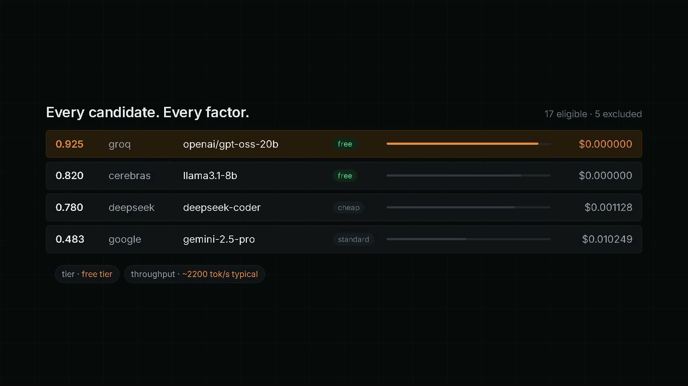
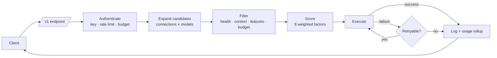

# Switchboard

**One endpoint. Every provider. Free tiers first, automatic fallback, everything local.**

Switchboard is an AI gateway that runs on your own machine. Point any OpenAI-compatible
tool at it and it decides — per request — which provider and model should serve the call,
preferring free tiers, routing around outages, and recording exactly why it chose what it
chose.

```
your tools ──▶ http://127.0.0.1:7272/v1 ──▶ Groq · Cerebras · Google · OpenRouter
                                            DeepSeek · Mistral · OpenAI · Anthropic …
```

Nothing leaves your machine except the upstream provider calls themselves. No telemetry,
no account, no cloud control plane.

---

## Demo

[](brag-output/brag.mp4)

**[▶ Watch the 20-second walkthrough](brag-output/brag.mp4)** — a provider 429s mid-request,
the fallback lands on a different one, and the decision trace explains exactly why the
replacement won. Every number in it is real output from a running instance.

---

## Why

Running six provider SDKs across four tools means six sets of keys, six failure modes, and
no idea what any of it costs. Switchboard collapses that into one endpoint with one key,
and answers three questions the raw SDKs cannot:

- **Which provider should serve this?** Scored live on health, latency, price and tier.
- **What happens when it is down?** The next candidate takes it, transparently.
- **What is this actually costing me?** Per request, per model, per key, against a
  frontier-pricing baseline.

---

## Quickstart

```bash
npm install
npm run build
npm start
```

Open **http://localhost:7272** — the dashboard walks you through connecting a provider
and creating a key.

Or from the CLI:

```bash
node bin/sb.mjs start --open
```

Then connect a free provider (Groq, Cerebras and Google all give real free tiers with no
card), create an API key, and point something at it:

```bash
curl http://127.0.0.1:7272/v1/chat/completions \
  -H "Authorization: Bearer sb-live-your-key" \
  -H "Content-Type: application/json" \
  -d '{"model":"auto","messages":[{"role":"user","content":"Hello"}]}'
```

`"model": "auto"` hands the decision to the router. You can also send a bare model id
(`llama-3.3-70b-versatile`), a pinned provider (`groq/llama-3.3-70b-versatile`), or a
policy slug you have defined.

---

## Point your tools at it

**Claude Code**

```bash
export ANTHROPIC_BASE_URL="http://127.0.0.1:7272/v1"
export ANTHROPIC_API_KEY="sb-live-your-key"
```

**Cursor** — Settings → Models → Override OpenAI Base URL

```
Base URL:  http://127.0.0.1:7272/v1
API Key:   sb-live-your-key
Model:     auto
```

**OpenAI SDK (Python)**

```python
from openai import OpenAI

client = OpenAI(base_url="http://127.0.0.1:7272/v1", api_key="sb-live-your-key")
response = client.chat.completions.create(
    model="auto",
    messages=[{"role": "user", "content": "Hello"}],
)
```

**OpenAI SDK (Node)**

```js
import OpenAI from 'openai';

const client = new OpenAI({
  baseURL: 'http://127.0.0.1:7272/v1',
  apiKey: 'sb-live-your-key',
});
```

**Cline / Continue / Aider** — any "OpenAI-compatible endpoint" field takes the same base
URL and key.

---

## Endpoints

| Method | Path | Notes |
| --- | --- | --- |
| `POST` | `/v1/chat/completions` | Streaming and non-streaming |
| `POST` | `/v1/completions` | Legacy, shimmed onto chat |
| `POST` | `/v1/embeddings` | |
| `POST` | `/v1/images/generations` | |
| `POST` | `/v1/audio/speech` | Returns audio bytes |
| `POST` | `/v1/audio/transcriptions` | Multipart upload |
| `POST` | `/v1/rerank` | |
| `POST` | `/v1/moderations` | |
| `GET` | `/v1/models` | Every model across every connected provider |
| `GET` | `/v1/models/{model}` | |

Every response carries routing telemetry, so you can debug from curl alone:

```
x-switchboard-request-id: req_6751a555d0264a6aa7e0
x-switchboard-provider: groq
x-switchboard-model: llama-3.3-70b-versatile
x-switchboard-tier: free
x-switchboard-attempts: 2
x-switchboard-cost-usd: 0.000083
x-switchboard-ttft-ms: 340
x-switchboard-fallback-reason: Rate limited (429), retry after 12s
```

`x-switchboard-fallback-reason` only appears when a fallback actually happened, so its
presence is itself the signal.

---

## Routing

A **policy** (called a combo in the API) is a model name your clients can send. Four ship
by default:

| Slug | Strategy | Optimises for |
| --- | --- | --- |
| `auto` | free-first | Exhaust free tiers before spending anything |
| `free-only` | free-first, $0 ceiling | Never spends money, fails instead |
| `fast` | fastest | Lowest observed time to first token |
| `quality` | quality-first | Strongest model available, price ignored |

Seven strategies are available:

| Strategy | Behaviour |
| --- | --- |
| `free-first` | Free tier, then cheap, then paid. The default. |
| `cost-optimized` | Lowest projected USD for this specific request. |
| `fastest` | Lowest measured p50 time-to-first-token. |
| `quality-first` | Inverts the cost factor — price becomes a quality signal. |
| `priority` | Strict chain order. Predictable, ignores live health. |
| `round-robin` | Spreads load across healthy members to stretch rate limits. |
| `failover` | First member always; others only on outright failure. |

Every candidate is scored on eight factors (health, latency, cost, tier, priority, quota,
throughput, stability), weighted per strategy. The weights are visible in the dashboard,
and the full arithmetic is stored with every request.

### The simulator

The routing page runs the exact expand-and-score path a live request takes, but stops
before sending anything upstream. Drag a member, move the cost ceiling, and watch the
ranking reshuffle — including which candidates were excluded and for what reason.

---

## Architecture



| Layer | Location |
| --- | --- |
| Domain contract | `src/types/core.ts` |
| Persistence | `src/lib/db/` — `node:sqlite`, WAL, append-only migrations |
| Providers | `src/lib/providers/` — catalog + 4 wire adapters |
| Resilience | `src/lib/resilience/`, `src/lib/health/` |
| Router | `src/lib/router/` — candidates → score → execute |
| Gateway API | `src/app/v1/` |
| Management API | `src/app/api/` |
| Dashboard | `src/app/(dashboard)/`, `src/components/` |

Storage is Node's built-in `node:sqlite` — no native module, no `node-gyp`, no prebuilt
binary roulette. `npm install` works the same on Windows as it does on Linux.

---

## Resilience

Three independent layers, so one failing provider never becomes a failing gateway:

1. **Circuit breaker**, per connection. Opens after N consecutive failures — immediately
   on a `401`, since a bad credential will not fix itself. Cooldown doubles on repeat
   opens, capped at 15 minutes, with jitter so recovering providers are not stampeded.
2. **Model lockout**, per model. A `429` locks out that one model rather than the whole
   connection, honouring `Retry-After` when the provider sends it.
3. **Fallback walk**, per request. Up to `maxAttempts` candidates, stopping early when
   retrying elsewhere cannot help — a malformed request produces the same `400` on every
   provider.

A streaming response that has already sent its first byte is **never** retried. Once bytes
are on the wire the client has committed, and a silent provider switch mid-stream would
corrupt the response.

---

## Configuration

Everything is optional; sane defaults are generated on first run.

| Variable | Default | Purpose |
| --- | --- | --- |
| `PORT` | `7272` | Gateway and dashboard |
| `SWITCHBOARD_DATA_DIR` | `./data` | Database, key vault, logs |
| `SWITCHBOARD_MASTER_KEY` | generated | Base64 32-byte key for credential encryption |
| `SWITCHBOARD_ALLOW_REMOTE` | `0` | Allow non-loopback dashboard access |
| `SWITCHBOARD_PACKAGED` | `0` | Set by the desktop build |

Provider credentials are sealed with **AES-256-GCM** before they touch disk. The master key
lives in `<data-dir>/master.key` with `0600` permissions. No endpoint returns a stored
credential — only a four-character hint.

---

## CLI

```bash
sb start [--port] [--open]   # start the gateway
sb status                    # health at a glance
sb doctor                    # diagnose the install
sb providers list            # connections with status and spend
sb providers add groq        # prompts for the key, echo off
sb providers test <id>       # force a probe
sb models [--free]           # available models with pricing
sb combos                    # routing policies
sb keys new <name>           # create an API key
sb chat [--model]            # streaming REPL
sb logs [--errors]           # recent requests
sb usage [--days 7]          # spend summary
sb open                      # open the dashboard
```

---

## Desktop app

```bash
npm run electron:build:win   # or :mac / :linux
```

Produces an installer in `release/`. The desktop build runs the gateway as a child process,
writes to a real app-data directory, and lives in the system tray with start-at-login,
copy-endpoint and restart controls.

Icons go in `electron/assets/icon.{ico,icns,png}` — the build works without them.

---

## Development

```bash
npm run dev          # dev server on :7272
npm run typecheck    # tsc --noEmit, strict
npm run build        # production build
npm run electron:dev # desktop shell against the dev server
```

Requires **Node 22.13+** — `node:sqlite` appeared in 22.5 but was flag-gated until 22.13.
Built with Next.js 16, React 19,
TypeScript 5.9 in strict mode with `noUncheckedIndexedAccess`, and Tailwind CSS v4.

Adding a provider is a single entry in `src/lib/providers/catalog.ts` when it speaks the
OpenAI wire format — see `docs/development.md`.

---

## License

MIT © 2026 Abeer Meer
